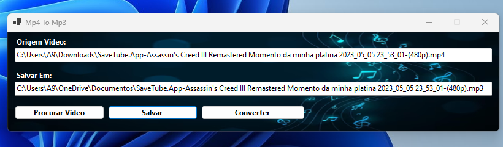

# WinFrmMp4ToMp3

## Description

 Desktop/Winforms project that converts mp4 file to mp3

- ⚡ C#
- ⚡ Winforms
- ⚡ NReco.VideoConverter 1.2.1

## Authors

Igo Ferreira Pinheiro

## Version History

* 0.1
    * Initial Release
    
<h3 align="left">Screen</h3>

